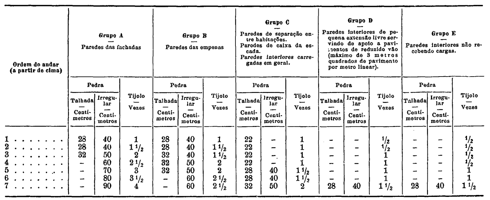

# 18. 

> As fundações dos edifícios serão estabelecidas sobre terreno estável e suficientemente firme, por natureza ou por consolidação artificial, para suportar com segurança as cargas que lhe são transmitidas pelos elementos da construção, nas condições de utilização mais desfavoráveis.

### Dúvidas

> As fundações dos edifícios serão estabelecidas sobre terreno estável e suficientemente firme

Isto quer dizer que o terreno não pode ser areia? O que é que seria um terreno não estável ou não suficiente firme?

# 19. + 20.

> 19.Quando as condições do terreno e as características da edificação permitam a fundação contínua, observar-se-ão os seguintes preceitos:
> 1) Os caboucos penetrarão no terreno firme até à profundidade de 50 centímetros, pelo menos, excepto quando se trate de rocha dura, onde poderá ser menor. Esta profundidade deve, em todos os casos, ser suficiente para assegurar a distribuição quanto possível regular das pressões na base do alicerce;
> 2) A espessura da base dos alicerces ou a largura das sapatas, quando requeridas, serão fixadas por forma que a pressão unitária no fundo dos caboucos não exceda a carga de segurança admissível para o terreno de fundação;
> 3) Os alicerces serão construídos de tal arte que a humidade do terreno não se comunique às paredes da edificação, devendo, sempre que necessário, intercalar-se entre eles e as paredes uma camada hidrófuga. Na execução dos alicerces e das paredes até 50 centímetros acima do terreno exterior utilizar-se-á alvenaria hidráulica, resistente e impermeável, fabricada com materiais rijos e não porosos.
> 4) Nos alicerces constituídos por camadas de diferentes larguras a saliência de cada degrau, desde que o contrário se não justifique por cálculos de resistência, não excederá a sua altura.

> 20.Quando o terreno com as características requeridas esteja a profundidade que não permita fundação contínua, directamente assente sobre ela, adoptar-se-ão processos especiais adequados de fundação, com observância, além das disposições aplicáveis do artigo anterior, de quaisquer prescrições especialmente estabelecidas para garantir a segurança da construção.

### Dúvidas

> Quando as condições do terreno e as características da edificação permitam a fundação contínua

Quando é que não permitem? Que condições são estas?

> ... excepto quando se trate de rocha dura, onde poderá ser menor.

Menor? É suposto eu inventar um valor qualquer para isto, tipo 25cm?

> não exceda a carga de segurança admissível para o terreno de fundação

Isto tem um valor? Muda para cada terreno de fundação?

> Os alicerces serão construídos de tal arte que a humidade do terreno não se comunique às paredes da edificação

Dá para fazer isto sem ser com "intercalar-se entre eles e as paredes uma camada hidrófuga"?

### Regras

1. `zCabouco = z(terreno) - z(fundo do cabouco)` 
`isRochaDura(terreno) ? <vAlOr MeNoR> : zCabouco >= 50cm`
2. `pressure(fundo do cabouco) <= <CaRgA dE sEgUrAnÇa AdMiSsÍvEl>`
3. TODO A regra de intercalar ?
4. `isAlvernariaHidraulica(alicerces e paredes até 50cm)`
5. `isFoundationSlabWeak() || foreachFoundationSlab(saliência(slab) <= altura(slab))`

# 25. + 26.

> 25.Para as paredes das edificações correntes destinadas a habitação, quando construídas de alvenaria de pedra ou de tijolo cerâmico maciço de 1.ª qualidade, com as dimensões de 0m,23 x 0m,ll x 0m,07, poderá considerar-se assegurada, sem outra justificação, a sua resistência, sempre que se adoptem as espessuras mínimas fixadas na tabela seguinte.
Espessura de paredes de alvenaria de pedra ou de tijolo (não incluídos rebocos e guarnecimentos)
> 
> 1. Quando se empreguem tijolos de outras dimensões, admitir-se-á a tolerância até 10 por cento nas espessuras correspondentes às indicações da tabela para as paredes de tijolo.
> 2. É permitido o emprego de alvenaria mista de tijolo maciço e furado nas paredes dos grupos A e B, nos dois andares superiores das edificações, desde que os topos dos furos ou canais dos tijolos não fiquem nos paramentos exteriores.
> 3. É permitido o emprego de tijolo furado nas paredes do grupo C nos dois andares superiores, nas do grupo D nos quatro andares superiores e nas do grupo E em todos os andares acima do terreno.
> 4. É obrigatório o emprego de pedra rija nas paredes de alvenaria de pedra irregular dos andares abaixo dos quatro superiores, sempre que se adoptem as espessuras mínimas fixadas.
> 5. A alvenaria de pedra talbada (perpianho ou semelhante) será constituída por paralelepípedos de pedra rija que abranja toda a espessura da parede.

> 26.As câmaras municipais só poderão autorizar, para as paredes das edificações correntes destinadas a habitação, construídas de alvenaria de pedra ou tijolo, espessuras inferiores aos mínimos fixados no artigo anterior, desde que:
> 1) Sejam asseguradas ao mesmo tempo as disposições porventura necessárias para que não resultem diminuídas as condições de salubridade da edificação, particularmente pelo que se refere à protecção contra a humidade, variações de temperatura e propagação de ruídos e vibrações;
> 2) Sejam justificadas as espessuras propostas, por ensaios em laboratórios oficiais ou por cálculos rigorosos em que se tenham em consideração a resistência veificada dos materiais empregados e as forças actuantes, incluindo nestas não só as cargas verticais, como também a acção do vento, as componentes verticais e horizontais das forças oblíquas e as solicitações secundárias a que as paredes possam estar sujeitas por virtude de causas exteriores ou dos sistemas de construção adoptados. Poderá também exigir-se o cumprimento do prescrito no corpo deste artigo, quaisquer que sejam as espessuras propostas, quando na construção das paredes se empreguem outros materiais ou elas tenham constituição especial.

### Dúvidas

> Ordem de andar (a partir de cima)

Acima do 7º é para considerar as regras do 7º?

> Tijolo vezes

vezes que dimensão? A largura? A largura é o 0m11

### Regras

0. As seguintes regras não se aplicam em paredes de simples preenchimento das malhas verticais das estruturas nas edificações construídas com estruturas independentes de betão armado ou metálicas e o menor vão livre da parede entre os elementos horizontais ou verticais da estrutura não excede 3m,50.
1. `foreachTopOneFloor_GroupA_PedraTalhadaWall(espessura(wall) >= 28cm || hasExternalAuthorization(wall))`
2. `foreachTopOneFloor_GroupA_PedraIrregularWall(espessura(wall) >= 40cm || hasExternalAuthorization(wall))`
3. `foreachTopOneFloor_GroupA_TijoloWall(espessura(wall) >= 1 * <DiMenNsÃo> || hasExternalAuthorization(wall))`
4. `foreachTopOneFloor_GroupB_PedraTalhadaWall(espessura(wall) >= 28cm || hasExternalAuthorization(wall))`
5. ...
6. `foreachTopOneFloor_GroupC_PedraIrregularWall(espessura(wall) > 0cm || hasExternalAuthorization(wall))`
7. ...
8. `foreachTopTwoFloor_GroupA_PedraTalhadaWall(espessura(wall) >= 28cm || hasExternalAuthorization(wall))`
9. `foreachTopTwoFloor_GroupA_PedraIrregularWall(espessura(wall) >= 40cm || hasExternalAuthorization(wall))`
10. `foreachTopTwoFloor_GroupA_TijoloWall(espessura(wall) >= 3 / 2 * <DiMenNsÃo> || hasExternalAuthorization(wall))`
11. ...
12. `foreachTopOneFloor_GroupA_TijoloDiferenteWall(espessura(wall) >= 1 * <DiMenNsÃo> * 0.9 || hasExternalAuthorization(wall))`
13. ...
14. `foreachTopFiveFloor_GroupA_PedraIrregularWall((isPedraRija(wall) && espessura(wall) >= 70cm) || hasExternalAuthorization(wall))`
15. ...

# 27.

> A justificação da resistência das paredes poderá ainda ser exigida quando tenham alturas livres superiores a 3m,50 ou estejam sujeitas a solicitações superiores às verificadas nas habitações correntes, particularmente quando a edificação se destine a fins susceptíveis de lhe impor sobrecargas superiores a 300 quilogramas por metro quadrado de pavimento ou de a sujeitar a esforços dinâmicos consideráveis.

### Regras

1. `foreachwall(alturaLivre(wall) <= 3.5m || isResistanceJustified(wall))`
2. `sobrecargaEdificio(Edificio) <= 300 kg/m^2 || foreachwall(isResistanceJustified(wall))` 

# 28.

> Nas edificações construídas com estruturas independentes de betão armado ou metálicas, as espessuras das paredes de simples preenchimento das malhas verticais das estruturas, quando de alvenaria de pedra ou de tijolo, poderão ser reduzidas até aos valores mínimos de cada grupo fixados no artigo 25.º, desde que o menor vão livre da parede entre os elementos horizontais ou verticais da estrutura não exceda 3m,50.

0. As seguintes regras só se aplicam em paredes de simples preenchimento das malhas verticais das estruturas nas edificações construídas com estruturas independentes de betão armado ou metálicas em que o menor vão livre da parede entre os elementos horizontais ou verticais da estrutura não excede 3m,50.
1. `foreachTopOneFloor_GroupA_PedraTalhadaWall(espessura(wall) >= 28cm)`
2. `foreachTopOneFloor_GroupA_PedraIrregularWall(espessura(wall) >= 40cm)`
3. `foreachTopOneFloor_GroupA_TijoloWall(espessura(wall) >= 1 * <DiMenNsÃo>)`
4. ...
5. `foreachTopTwoFloor_GroupA_PedraTalhadaWall(espessura(wall) >= 28cm)`
6. `foreachTopTwoFloor_GroupA_PedraIrregularWall(espessura(wall) >= 40cm)`
7. `foreachTopTwoFloor_GroupA_TijoloWall(espessura(wall) >= 1 * <DiMenNsÃo>)`
8. ...

# 29.

> A construção das paredes das caves que ficarem em contacto com o terreno exterior obedecerá ao especificado no n.º 3) do artigo 19.º deste regulamento. Nas caves consideradas habitáveis, quando não se adoptem outras soluções comprovadamente equivalentes do ponto de vista da salubridade da habitação, a espessura das paredes não poderá ser inferior a 60 centímetros e o seu paramento exterior será guarnecido até 20 centímetros acima do terreno exterior, com revestimento impermeável resistente, sem prejuízo de outras precauções consideradas necessárias para evitar a humidade no interior das habitações.

### Regras

1. `foreachBasementWall(guaranteesSalubridade(wall) && z(guarnecimento da parede) - z(terreno) == 20cm)`

# 30

todo